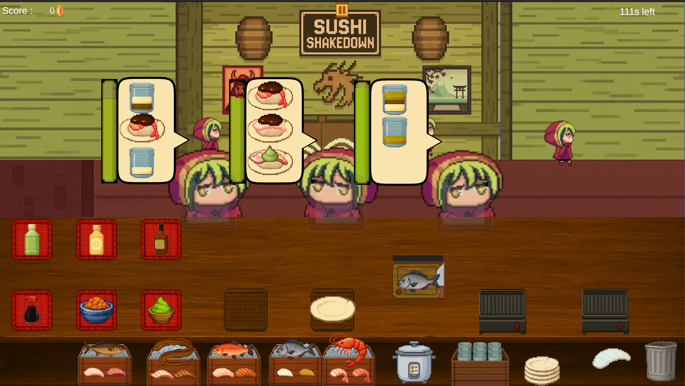

# Sushi Shakedown

🏆 **Selected for SUTD Open House 2026 Display** - Chosen to represent the program's best student work

## Technologies
* **Game Engine**: Unity/C# 
* **Programming**: Object-oriented design with modular architecture
* **UI/UX**: Point-and-click interface with drag-and-drop mechanics
* **Data Management**: Real-time resource tracking and persistence
* **Game Systems**: Multi-threaded time management and event handling

## Project Overview

A strategic time management game that combines restaurant simulation with debt repayment mechanics in an anime-inspired setting. Players operate a sushi bar to pay off gambling debts to the Yakuza while managing complex resource systems, customer satisfaction, and strategic upgrades with meaningful trade-offs.

**Core Innovation**: Unlike traditional restaurant games, our upgrade system introduces risk-reward mechanics where improvements can overwhelm players if not properly managed, creating deeper strategic gameplay.

## Key Features

### 🎮 **Advanced Game Systems**
- **Dynamic Customer AI**: Patience-based customer behavior with varying complexity orders
- **Multi-Resource Management**: Money, time, ingredients, staff morale, and equipment durability
- **Strategic Upgrade System**: Trade-off based progression with risk-reward mechanics
- **Adaptive Difficulty**: Balatro-inspired daily debt scaling with survival elements

### 🏗️ **Technical Architecture**  
- **Modular Design**: Separate systems for cooking, serving, resource management, and UI
- **Event-Driven Programming**: Efficient handling of customer orders, equipment failures, and time events
- **State Management**: Complex game state tracking across daily and weekly cycles
- **Performance Optimization**: Smooth gameplay during peak customer flow scenarios

### 🎨 **User Experience Design**
- **Intuitive Controls**: Point-and-click with keyboard shortcuts for advanced players
- **Visual Feedback**: Clear indicators for customer patience, equipment status, and resource levels
- **Accessibility**: Designed for both casual and mid-core gaming audiences
- **Narrative Integration**: Comedic Yakuza storyline with meaningful consequences

## Technical Challenges Solved

#### **Complex Resource Balancing**
Implemented sophisticated algorithms to balance multiple interdependent resource systems, ensuring strategic depth without overwhelming complexity.

#### **Real-time Multi-tasking Simulation**
Developed efficient event handling for simultaneous customer orders, cooking timers, and staff management under time pressure.

#### **Scalable Difficulty System**
Created adaptive progression mechanics that increase challenge while maintaining player engagement through strategic decision-making.

#### **User Interface Optimization**
Designed intuitive UI that handles complex information display without cluttering the gaming experience.

## Game Design Philosophy

Our design philosophy centered on creating **meaningful choices** through strategic trade-offs. Every upgrade decision impacts multiple game systems, requiring players to think several steps ahead. This approach differentiates our game from traditional time management titles by adding genuine strategic depth.

**Key Design Principles:**
- **Risk-Reward Balance**: Upgrades provide benefits but introduce new challenges
- **Emergent Complexity**: Simple mechanics combine to create complex strategic situations  
- **Player Agency**: Multiple viable strategies allow for different playstyles
- **Narrative Integration**: Mechanical systems support and enhance the comedic storyline

## User Testing & Iteration

Conducted comprehensive user testing across two rounds with external participants:

- **Round 1**: Identified initial balance issues and UI clarity problems
- **Round 2**: Validated improvements and refined difficulty progression
- **Final Polish**: Implemented accessibility improvements and performance optimizations

--
*This project demonstrates advanced game development skills including system architecture, algorithm design, user experience optimization, and team collaboration in a professional development environment.*